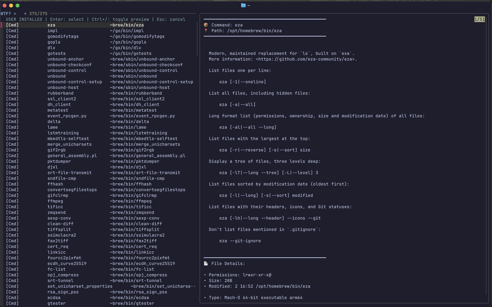
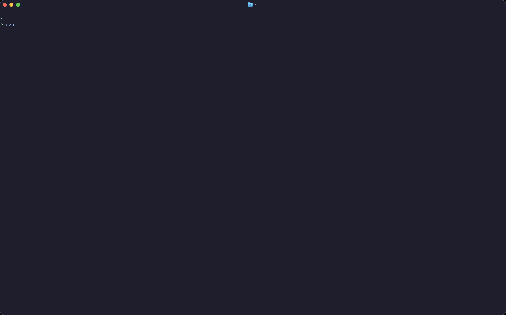

# WTF - What The F*** Can I Run?

> A blazing-fast terminal launcher with built-in documentation - discover, understand, and run your installed tools

[](https://github.com/adriangalilea/wtf/releases)
[](https://opensource.org/licenses/MIT)

## The Problem

You've installed 200+ tools via Homebrew, npm, cargo, pip, and who knows what else. You remember maybe 5 of them. The rest? Lost in the void of `/opt/homebrew/bin`, `~/.cargo/bin`, `/usr/local/bin`...

## The Solution

`wtf` - A smart command launcher that:
- 📖 **Shows instant help** - See tldr/man pages in the preview pane WITHOUT running commands
- 🔍 Discovers all your installed tools automatically
- 🚀 Launches them with fuzzy search
- 📊 Learns what you use most (frecency)
- 🐚 Works with any shell (Fish, Zsh, Bash)
- ⚡ Lightning fast (pure Python, no shell loops)

## Quick Install

### Prerequisites
```bash
# Required
brew install fzf          # Fuzzy finder (required)
brew install python@3.12  # Python 3.12+

# Optional but recommended
brew install tealdeer     # Better command documentation (tldr pages)
```

> **Note**: There's an existing `wtf` command (acronym translator) in Homebrew. If you have conflicts, you can:
> - Use an alias: `alias wtfl='path/to/wtf'` (wtf launcher)
> - Install via pipx/uv which isolates the command: `pipx install wtf-launcher`
> - Or rename the Homebrew one: `brew unlink wtf`

### Install with uv (recommended)
```bash
# Install uv if you haven't already
curl -LsSf https://astral.sh/uv/install.sh | sh

# Clone and install
git clone https://github.com/adriangalilea/wtf
cd wtf
uv tool install -e .

# Ensure ~/.local/bin is in your PATH
# Fish users: fish_add_path $HOME/.local/bin
# Bash/Zsh users: export PATH="$HOME/.local/bin:$PATH"
```

### Shell Integration

The `wtf` command needs shell integration to properly insert commands into your prompt (instead of just printing them).

#### Fish
```fish
# Add to ~/.config/fish/config.fish
function wtf --description "What the f*** can I run?"
    command wtf | read -l cmd
    and commandline -r $cmd
end

bind \ew 'wtf'  # Option+W to launch
```

Or run this to see the code:
```bash
wtf init fish
```

#### Zsh/Bash
```bash
# Add to ~/.zshrc or ~/.bashrc
eval "$(wtf init zsh)"  # Or use 'wtf init bash' for Bash
```

This will:
- Create a shell function that captures wtf's output
- Insert the selected command into your prompt (not execute it)
- Set up Option+W (or Alt+W) keybinding for quick access

**Without shell integration**, wtf will just print the command path, which isn't very useful.

## Usage

```bash
wtf                      # Show only user-installed commands (default)
wtf --all/-a            # Show ALL commands including system utilities
wtf config              # Edit configuration file
wtf --list/-l           # List all commands to stdout (for piping)
wtf --list --all        # List all commands including system
wtf init <shell>        # Generate shell integration code
```

### Screenshots


*WTF in action - showing command preview for `eza` with documentation*


*Clean exit - your terminal remains untouched*

### Built-in Help Preview 📖

WTF shows you instant documentation for any command **without running it**! As you navigate through commands, the preview pane displays:

- **tldr pages** - Concise examples and explanations (if `tealdeer` is installed)
- **man pages** - Traditional documentation
- **--help output** - When other docs aren't available

This means you can quickly understand what a command does before using it. No more accidentally running dangerous commands or forgetting what that cryptic tool name means!

### Keyboard Shortcuts
- `Alt+W` / `Option+W` - Quick launch
- `↑↓` - Navigate options
- `Enter` - Insert selected command into prompt
- **`Ctrl+/` - Toggle preview pane (shows tldr/man/help)**
- `Esc` - Cancel

### System vs User Commands

By default, `wtf` filters out pre-installed system commands to focus on what YOU installed. System paths that are excluded:

- `/bin/*` - Core system utilities (cat, ls, cp, etc.)
- `/sbin/*` - System administration commands
- `/usr/bin/*` - User utilities (git, ssh, etc.) 
- `/usr/sbin/*` - User admin utilities
- `/System/*` - macOS system files

Use `wtf --all` to see everything including system commands.

### Configuration

WTF uses a JSON configuration file at `~/.config/wtf/config.json`. Edit it with:

```bash
wtf config
```

Configuration options:

```json
{
  "system_paths": [
    "/bin/",
    "/sbin/",
    "/usr/bin/",
    "/usr/sbin/",
    "/System/"
  ],
  "extra_search_paths": [
    "/opt/homebrew/bin",
    "/usr/local/bin",
    "~/.cargo/bin",
    "~/.local/bin"
  ],
  "categories": {
    "git": ["git", "tig", "gh"],
    "editors": ["vim", "nvim", "hx", "code"]
  },
  "dangerous_commands": ["rm", "dd", "mkfs"],
  "excluded_commands": ["pip-*", "*-config", "git-receive-pack"],
  "show_paths": true,
  "preview_enabled": true
}
```

- `system_paths`: Paths to exclude when not using `--all`
- `extra_search_paths`: Additional paths to search for commands
- `categories`: Custom categorization rules
- `dangerous_commands`: Commands to never execute in preview
- `excluded_commands`: Commands to always hide (supports wildcards)
- `show_paths`: Show paths in the command list
- `preview_enabled`: Enable preview pane by default

## Features

### Current (v0.1)
- ✅ **Rich previews** - Shows tldr pages, man pages, or help text WITHOUT executing
- ✅ Discovers commands from multiple sources (PATH, Homebrew, npm, cargo, etc.)
- ✅ Fuzzy search with fzf integration (searches command names only, not paths)
- ✅ Smart categorization (Git, Editors, Package managers, etc.)
- ✅ Shell-agnostic Python core (Fish, Zsh, Bash support)
- ✅ Frecency tracking - Your most-used commands bubble to the top
- ✅ Pydantic-based config file - Fully customizable
- ✅ System command filtering - Focus on YOUR tools by default
- ✅ Automatic deduplication - No duplicate entries for CLI/App versions
- ✅ Excludes junk commands - Hides build tools, internals, and noise

### Planned (v1.0)
- 📝 **Custom aliases** - Add descriptions to cryptic commands
- 🎨 **Themes** - Because developers like pretty things
- 🔌 **Plugin system** - Add custom command sources

### Future (v2.0+)
- 🔍 **Help-based search** - Fuzzy search command descriptions, not just names
- 🤖 AI command suggestions based on context
- 🌐 Command sharing/sync across machines
- 📊 Usage analytics and insights

## Architecture

```
wtf/
├── wtf.py               # Main launcher (Carmack style - flat and direct)
├── wtf_config.py        # Pydantic configuration
├── wtf_preview.sh       # Preview script for fzf
├── pyproject.toml       # Modern Python packaging with uv
└── README.md
```

Simple, flat structure. No over-engineering.

## What We Built

- ✅ **Fast Discovery** - Finds all your commands from PATH, Homebrew, npm, cargo, etc.
- ✅ **Smart Filtering** - Separates YOUR tools from system commands
- ✅ **Rich Previews** - Shows tldr/man pages without executing commands
- ✅ **Frecency Tracking** - Most-used commands rise to the top
- ✅ **Full Configuration** - Pydantic-based config with validation
- ✅ **Multi-shell Support** - Works with Fish, Zsh, and Bash
- ✅ **Safe Preview** - Never executes dangerous commands
- ✅ **Clean Architecture** - Single file, no dependencies except Pydantic

## Contributing

This project is in early development. Ideas, bug reports, and PRs welcome!

### Development Setup
```bash
git clone https://github.com/adriangalilea/wtf
cd wtf
uv venv
source .venv/bin/activate
uv pip install -e .
```

## Why Python?

- **Portability**: Works everywhere, no compilation needed
- **Speed**: Fast enough for this use case (launching is instant)
- **Ecosystem**: Rich libraries for shell integration, caching, etc.
- **Iteration**: Much faster to develop and maintain than Rust/Go
- **Distribution**: Easy via pip, pipx, uv, conda, homebrew

## License

MIT - Do whatever the f*** you want with it.

---

*Built with ❤️ and frustration by developers who can't remember what they installed*